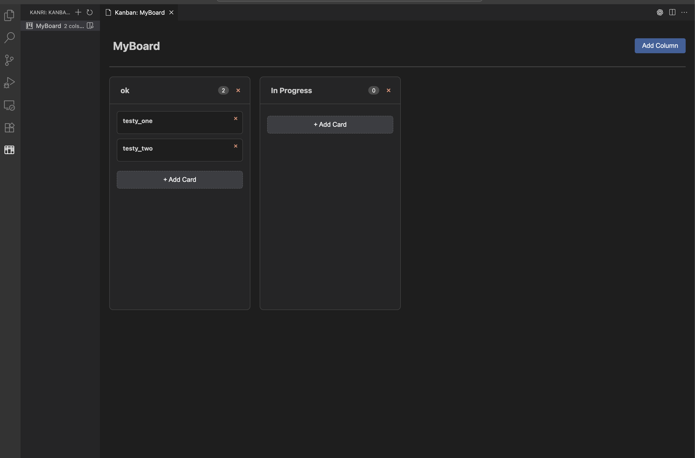

# Kanri for VS Code

Visual Kanban boards for project management directly in Visual Studio Code. Create, manage, and organize your tasks with intuitive drag-and-drop cards and customizable columns.

## Screenshot


*Create and manage your tasks with visual kanban boards directly in VS Code*

## Features

- **Visual Kanban Boards**: Create beautiful, interactive kanban boards within VS Code
- **Card Management**: Add, edit, move, and delete cards with ease
- **Column Customization**: Create custom columns to match your workflow
- **Drag & Drop**: Intuitive card movement between columns
- **Persistent Storage**: Your boards are automatically saved per workspace
- **Clean Interface**: Modern UI that integrates seamlessly with VS Code
- **Performance**: Fast, responsive interface built with Microsoft's best practices

## Quick Start

1. Install the extension
2. Open Command Palette (`Cmd+Shift+P` / `Ctrl+Shift+P`)
3. Run command: `Kanri: Create Board`
4. Enter a board name and start organizing your tasks!

## Usage

### Creating a Board
- Command: `Kanri: Create Board`
- Creates a new kanban board with default columns (To Do, In Progress, Done)

### Managing Cards
- **Add Card**: Click the "+" button in any column
- **Move Card**: Drag and drop cards between columns
- **Edit Card**: Click on a card to edit its content
- **Delete Card**: Use the delete button on any card

### Customizing Columns
- **Add Column**: Use the "Add Column" button
- **Delete Column**: Remove empty columns as needed
- **Reorder Columns**: Drag column headers to reorder

## Configuration

```json
{
  "kanri.defaultColumns": ["Backlog", "In Progress", "Review", "Done"],
  "kanri.autoSave": true
}
```

## Requirements

- Visual Studio Code 1.74.0 or higher

## Known Issues

- Boards are workspace-specific (not synced across workspaces)
- No collaborative editing support yet

## Release Notes

### 0.1.7
Fixed activity bar icon visibility across all VS Code themes, removed all emojis from codebase for professional appearance

### 0.1.6
Complete kanban functionality with drag and drop positioning, board deletion, Microsoft compliance, marketplace preparation

### 0.1.0
Initial release - Basic kanban board functionality, card management, column management, persistent storage, drag and drop interface

## Architecture Overview

### Core Components
- **Extension Entry Point** (`extension.ts`) - Main activation and command registration
- **Board Manager** (`managers/boardManager.ts`) - Handles kanban board operations
- **Card Manager** (`managers/cardManager.ts`) - Manages kanban card operations
- **Storage** (`storage/fileStorage.ts`) - Persistent data management
- **Views** (`views/boardsViewProvider.ts`) - Webview implementation

### Data Models
- `KanbanBoard` - Complete board structure with metadata
- `KanbanColumn` - Column definitions with card collections
- `KanbanCard` - Individual task cards with rich metadata

## Development Setup

```bash
npm install
npm run compile
npm run watch  # for development
```

## Configuration Examples

```json
{
  "kanri.defaultColumns": ["Backlog", "To Do", "In Progress", "Review", "Done"],
  "kanri.autoSave": true,
  "kanri.boardsDirectory": ".kanri"
}
```

## Future Enhancements

- [ ] Webview-based kanban board visualization
- [ ] Board templates and themes
- [ ] Export/import functionality
- [ ] Team collaboration features
- [ ] Time tracking and reporting

## License

[MIT](LICENSE) - See LICENSE file for details.

## Acknowledgments

Inspired by [Kanri](https://github.com/trobonox/kanri). This is an independent implementation built specifically for VS Code.
